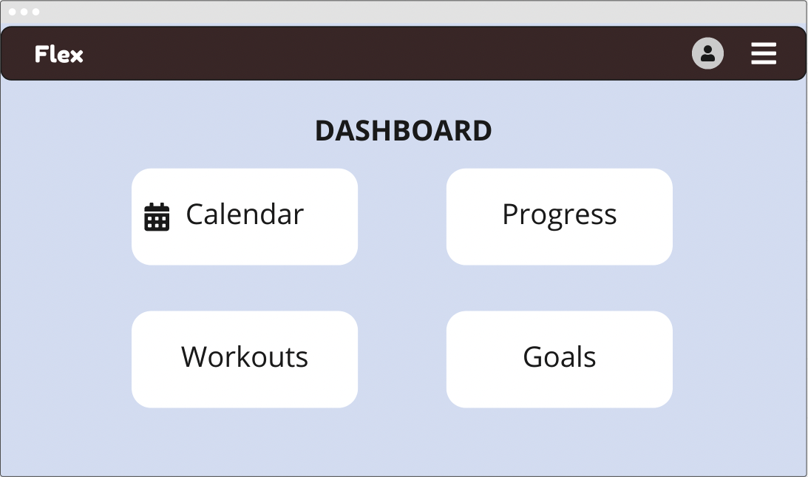
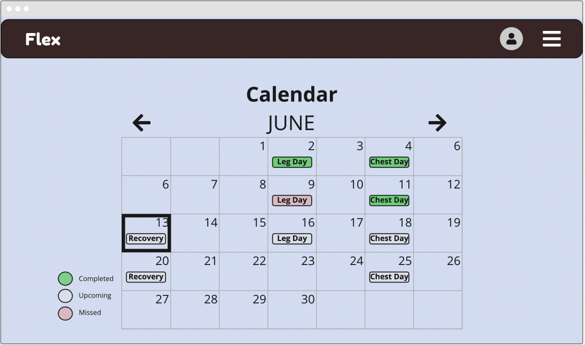
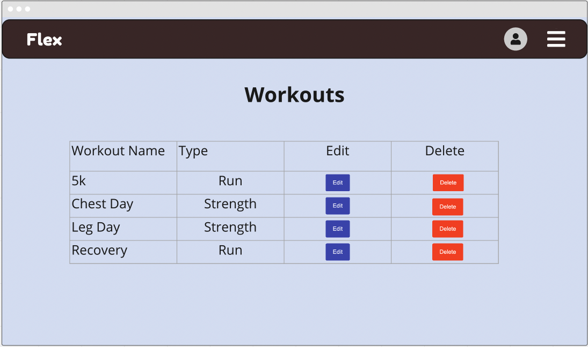
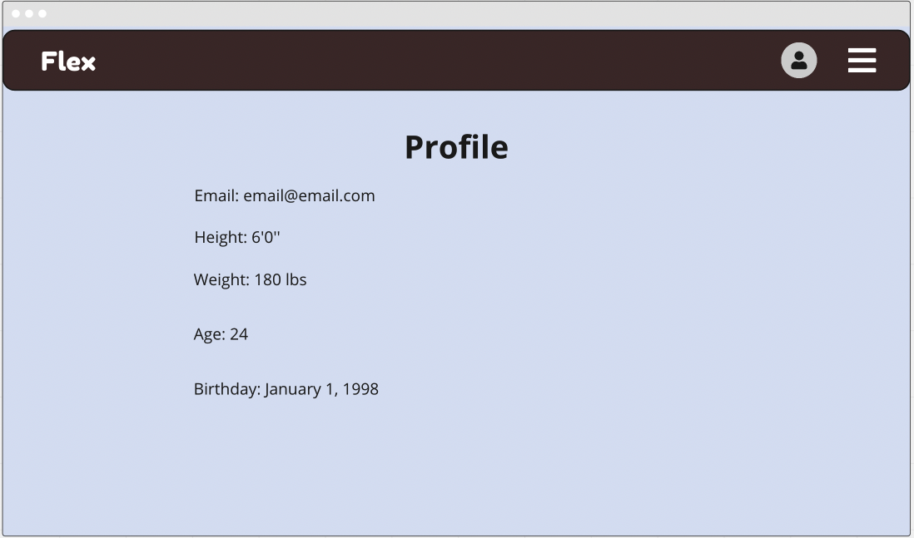
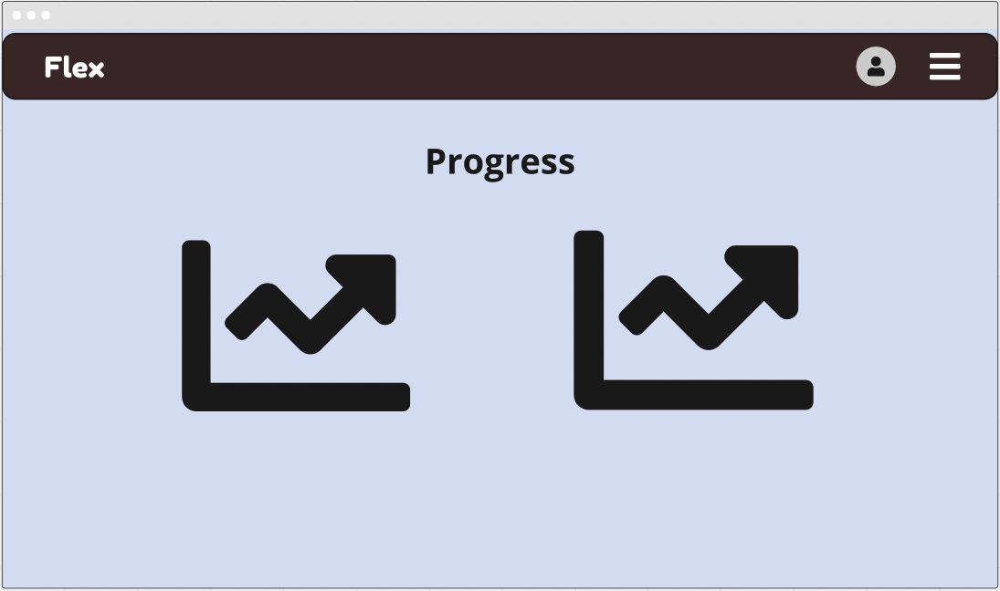
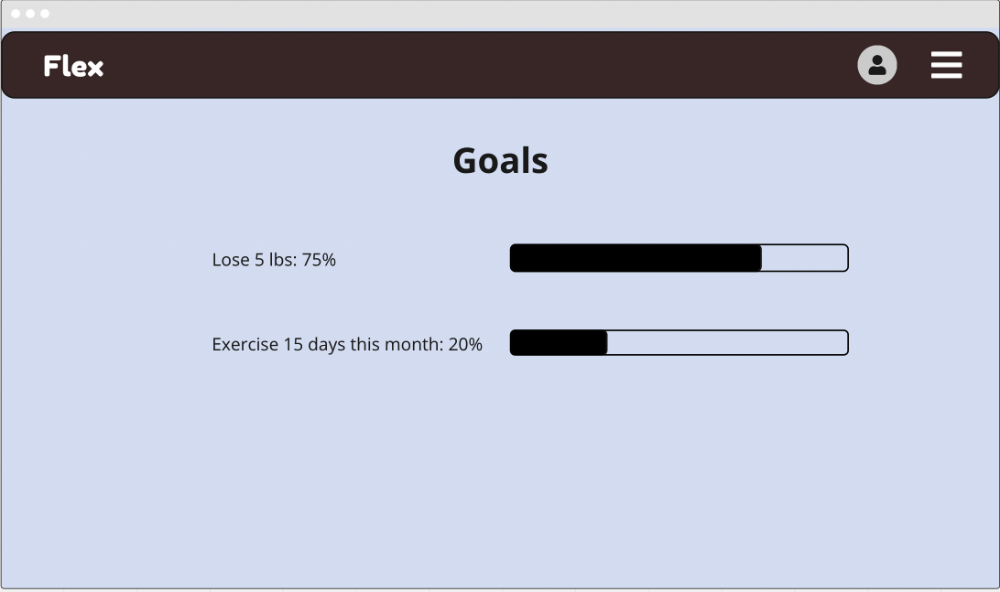
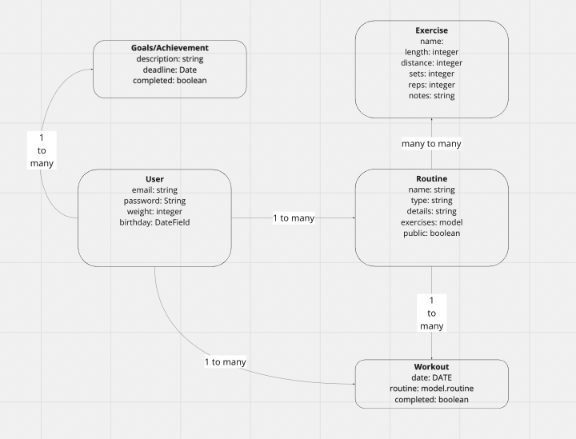

# Project 4 Pitch

## App Description

Flex will be a workout app where users can add their workouts. Workouts can be added in different categories (running, swimming, weight training, etc). Workouts can be scheduled and completed, and the user will be able to see a calendar of all past and future workouts. Users will need to create accounts and their information/workouts will require authorization to access. 

Users will also have a choice to save workout templates and make these public. Users will be able to save public templates and schedule/complete them. User will be able track their progress and statistics (such as weight, BMI, personal records) over time

## Technologies

* Python
* Django
* Pytest

## Questions

How do you plan on learning/implementing this new technology?

* Youtube tutorials, building small proof of concept apps

What is your goal with this project?

* get more comfortable working with Django on the backend and take full advantage of the built in auth features. 

* become proficient in TDD and utilize it in the development process.

* put out a polished project that will be showcased in my portfolio. 

Who is the user for your app?

* People who track their fitness.

Any potential roadblocks you think you might run into?

* Time. Learning Python/Django alongside pytest will be time consuming. TDD development will also be time consuming.

* Figuring out how to run tests for all of my features, especially more complicated ones like the calendar feature.

* Implementing the calendar model

## Wireframes

### Dashboard: User's personal Hub

### Calendar: User's workout schedule in calendar format

### Workouts: User's personal workouts list

### Profile: User's profile info

### Progress: User's Progress shown as visual data

### Goals: User's Achievements + Custom Goals

## ERD

## User Stories

1. A user will be able to create an account and perform full CRUD actions on Workouts.

1. A user can schedule workouts to be completed at a certain time, viewing past and future workouts on a calendar.

1. A user can complete workouts and add notes (e.g. time elapsed, weight, comment)

1. A user can make their workouts public and view/save other public workouts. 

1. A user can see data showing their progress (weight, personal records, activity, etc)

## Sprints

### 07/13

* Build out a basic Django Calendar App using test driven development.

* Begin constructing the models and backend through Django 

### 07/14 

* Finish the backend models

* Start building out the front-end

* Log in Users and give them full Crud functionality over workout routines and goals 

### 07/15 -07/16

* Work on the calendar: rendering it, different views for day, week, month. 

* Work on adding events to the calendar and seeing them display 

* Add completing workouts feature and reflect the completion on calendar 

### 07/17 

* Work on displaying progress data over time, activity history, weight lifted, weight lost, personal records

* Display data in graphs that are visually appealing

### 07/18

* Fine tune styling, color scheme, etc 

## 07/19 

* Plan out presentation

* Plan and continue to work on stretch goals 
